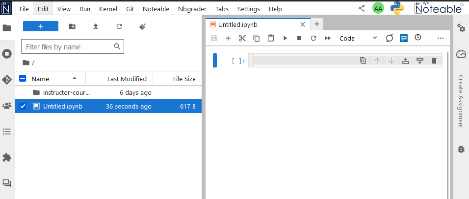
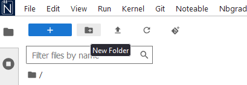
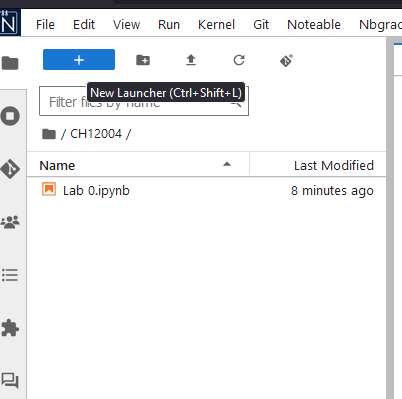

# Getting started with Noteable

For this course, you will be using Noteable to host and run your Jupyter notebooks.

## Logging into Noteable

Access Noteable via the link on the CH12004 Moodle page.

```{image} images/noteable_widget.png
:width: 150px
:align: center
```

You'll be presented with a page like this


Select "Standard Notebook (Python 3)" and click "Start".

If this is the first time you have logged on to Noteable, you will see the following:


On the left is the Jupyter **File Browser**, which shows all of your files and folders/directories saved in Noteable. On the right is the **Launcher**, which contains buttons for quickly creating notebooks and shells. 

## Creating a new Jupyter notebook

To create a new Jupyter notebook, click on the `Python3 (ipykernel)` button in the **Notebook** section of the **Launcher**.


This will open a new Jupyter Notebook document in a new browser window, which should look like this:



## Renaming notebooks

We will look at using Jupyter Notebooks in more detail later. For now, notice at the top you have the text &ldquo;Untitled&rdquo;. This is a placeholder filename that has been assigned to this new Notebook you have just created. To rename your notebook, right click on `Untitled.ipynb` in the **File Browser** and click rename.


Rename your notebook to something more meaningful (e.g., &ldquo;Lab 0&rdquo;) by typing the new name and hitting Enter.

You should then see the notebook name at the top of the screen change to the new name.

<!-- 
## Notebook management

Switch back to the browser window containing the Jupyter file browser. 
You should now see your notebook (with its new name) in the list of files:


The notebook symbol to the left of the filename tells you that this file is a Notebook.
The symbol is green because this Notebook is open (or &ldquo;running&rdquo;).
You can also see the status of this Notebook on the righthand side as &ldquo;Running&rdquo;.
The file browser also shows you how recently this notebook was modified and the size of the notebook on the disk.

Running notebooks uses resources (memory and CPU) on whichever computer you are running on.
In this instance, these are servers run by Noteable.
Having a large number of notebooks Running at the same time can consume a lot of resources and make your calculations run slowly.
It is good practice to stop (Shutdown) notebooks that you are not currently working on or using to perform calculations.
Closing the window that a notebook is running in does not shutdown that notebook (it will still have a green icon in the file browser).

You can Shutdown any running notebooks by selecting them in file browser (click the tick box to the left of the filename) and then clicking **Shutdown**:
```{image} images/shutdown_menu.png
:width: 250px
:align: center
```

Notice that the notebook icon next to the filename is now grey, indicating a notebook that is not running.
The word &ldquo;Running&rdquo; has also gone from the righthand side of the file information row:


You can also close and shutdown a running notebook from the notebook window itself, by clicking on the **File** menu item and selecting **Close and Halt**:
```{image} images/close_and_halt.png
:width: 250px
:align: center
``` -->

## Using folders

While you could keep all of your notebooks in your top-level folder (what you see when you first log in to Noteable), over time, this can make it difficult to find the specific notebook you are looking for, so it is better to organise your notebooks using folders.

In the **File Browser**, click the **New Folder** icon to create a new folder.



Name this folder `CH12004`. This is where you should place all of your Jupyter Notebook files.

Drag and drop your `Lab 0.ipynb` file into the `CH12004` folder. It might take a second for the file to "disappear", but if you double click on the `CH12004` folder, you'll now see your notebook.

To make a new notebook in this directory, simply click the blue `+` button to make a new **Launcher**.



And then click the `Python3 (ipykernel)` Button in the **Notebooks** section.


## Closing down and reconnecting
Close all of your Noteable browser windows.
Your folders and files are saved on the Noteable server.
You can reconnect to the server and see your folders and files by clicking again on the Noteable link on the CH12004 Moodle page.

